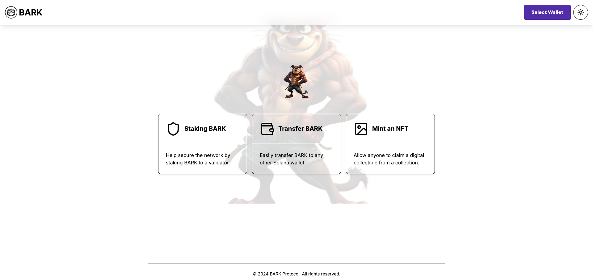

# BARK Blink

BARK Blink is an application for managing BARK tokens and Solana actions. It includes features like staking BARK, transferring tokens, and minting NFTs.

## Features

- **Staking BARK**: Secure the network by staking BARK to a validator.
- **Transfer BARK**: Easily transfer BARK to any Solana wallet.
- **Mint an NFT**: Allow users to claim digital collectibles from a collection.

## Usage

1.**Transfer BARK Tokens**

Navigate to the TransferBarkPage component in your application.
Enter the recipient's Solana address and the amount of BARK tokens to transfer.
Submit the form to initiate the transfer.

2. **Mint NFTs**

Navigate to the MintNFTPage component in your application.
Enter the metadata URI, name, and symbol for the NFT.
Submit the form to mint a new NFT.

3. **Stake Tokens**

Navigate to the StakePage component in your application.
Enter the amount of tokens to stake.
Submit the form to stake the tokens.

## Screenshot



## Installation

To get started with BARK Blink, follow these steps:

1. **Clone the Repository**:

    ```bash
    git clone https://github.com/barkprotocol/bark-blink.git
    ```

2. **Navigate to the Project Directory**:

    ```bash
    cd bark-blink
    ```

3. **Install Dependencies**:

    ```bash
    npm install
    ```

4. **Set Up Environment Variables**:

    Create a `.env.local` file in the root directory and add your environment variables. Example:

    ```env
    NEXT_PUBLIC_SOLANA_NETWORK=mainnet
    NEXT_PUBLIC_METAPLEX_API_KEY=your_metaplex_api_key
    ```

5. **Run the Development Server**:

    ```bash
    npm run dev
    ```

    Open your browser and navigate to `http://localhost:3000`.

## Usage

- **Staking BARK**: Navigate to `/stake` to stake your BARK tokens.
- **Transfer BARK**: Visit `/transfer` to transfer BARK tokens to another wallet.
- **Mint an NFT**: Go to `/mint-nft` to mint a new NFT.

## Contributing

Contributions are welcome! Please follow these guidelines:

1. Fork the repository.
2. Create a new branch for your changes.
3. Commit your changes with a descriptive message.
4. Push your branch to your forked repository.
5. Open a pull request against the `main` branch of the original repository.

## License

This project is licensed under the MIT License. See the [LICENSE](LICENSE) file for details.

## Contact

For any questions or issues, please open an issue on GitHub or contact us at [support@barkprotocol.net](mailto:support@barkprotocol.net).
